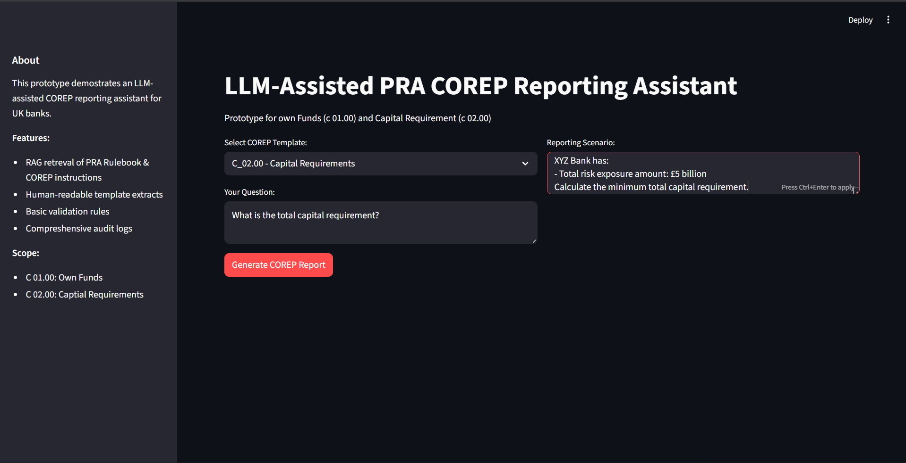
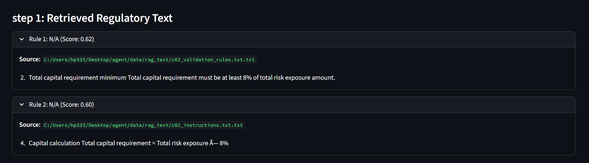
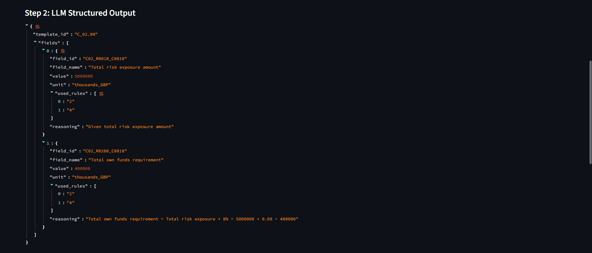
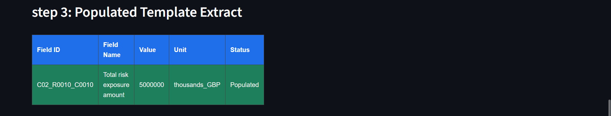
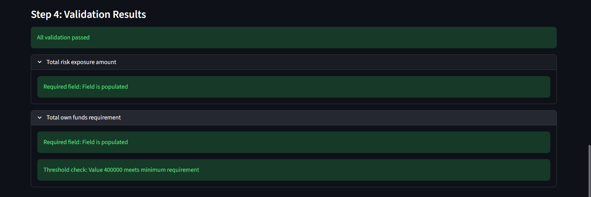
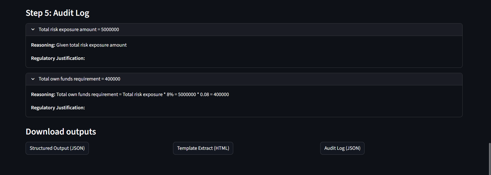

# COREP AI Agent prototype
An LLM agent that take user query and UK banks data and give appropiate answer and JSON format and basice validations and reasoninig for how it get that conclusion.
## Technologies Used 
- **Python 3.11+**
- **Frontend**: python, streamlit
- **LLM**: llama-3.3-70b-versatile
- **prompt style**: Fewshot prompt with spacific JSON output schema
- **Rag Database**: Faiss
- **others**: GROQ online request response and request tracking 
## Installation
## Prerequisites
- Python 3.8 or higher
- pip package manager
### Setup
1. **Clone the repo**
```bash
git clone https://github.com/Harsh0patel/COREP-Agent-prototype
```
2. **Create a virtual enviroment**
```bash
python -m venv myenv
scource venv/bin/activate # On Windows: myenv\Scripts\Activate
```
3. **Install dependencies**
```bash
pip install -r requirements.txt
```
## To run locally
1. **run below command on cmd after running whole setup**
```bash 
python -m streamlit run app.py
```
## Example 
**Input Text:**
```
COREP Template: C_01.00-Own Funds

User-Query: how do i calculate CET1 capital and CET1 ratio?

Reporting Scenario:
ABC Bank has the following:
- Paid-up share capital: £500 million
- Share premium: £100 million  
- Retained earnings: £200 million
- Goodwill: £50 million
- Total risk exposure amount: £10 billion
```
**Generated Summary:(JSON only)**
```json
{"template_id":"C_01.00",
    "fields":[{
        "field_id":"C01_R0010_C0010",
        "field_name":"Common Equity Tier 1 (CET1) capital",
        "value":750000,
        "unit":"thousands_EUR",
        "used_rules":["Article 92(2)(a) of CRR"],
        "reasoning":"Share capital 500M + Retained earnings 200M + Share premium 100M - Goodwill 50M = 750M"
    },
    {
        "field_id":"C01_R0015_C0010",
        "field_name":"Common Equity Tier 1 capital ratio",
        "value":7.5,
        "unit":"%",
        "used_rules":["Article 92(2)(a) of CRR"],
        "reasoning":"CET1 capital 750M / Total risk exposure amount 10000M * 100 = 7.5%"
    }]
}
```

## Example(Images)

**input slide**


**output slides**






## Project Structure
```
COREP-Agent/
|──data/
|   |──processed/
|   |   |──metadata.pkl
|   |   |──vector_index.faiss
|   |──rag_text/
|   |   |──c01_instruction.txt
|   |   |──c01_validation_rules.txt
|   |   |──c02_instruction.txt
|   |   |──c02_validation_rules.txt
|   |──tamplates/
|   |   |──c01_schema.json
|   |   |──c02_schema.json
|──src/
|   |──agent.py
|   |──Audit_logger.py
|   |──build_index.py
|   |──mapper.py
|   |──rag.py
|   |──renderer.py
|   |──validator.py
|──.gitignore
|──app.py
|──readme.md
```
## Future Enhancements for better Scaling
1. decopule Frontend and Backend codes
2. deploy Backend/Agent API using FastAPI, Proper RAG and database 
3. dockerize the Agent for fast code deployments

## Disclaimer
This is just a prototype so it has only small amount or RAG data for spacific c01 and c02 corep rules so sometime it will not find all rules we can improve it by providing every rule of c01 and c02 in rule book.

## Author

**Harsh Patel**
- GitHub: [@Harsh0patel](https://github.com/Harsh0patel)
- Email: hp333854@gmail.com